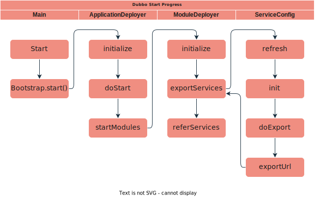

# SUMMARY

Dubbo 的启动会涉及到各个组件, 每个组件具体做的事情可以在 [组件详解](组件详解.md) 中了解到. 本篇文章会通过一些线索,
将分散在不同组件中的行为组织起来介绍.

# 启动服务

## 服务端

通过简单几行代码, 我们就能启动一个 Dubbo 服务端:

1. [创建 DubboBootstrap 实例](../dubbo-demo/dubbo-demo-api/dubbo-demo-api-provider/src/main/java/org/apache/dubbo/demo/provider/Application.java#L48)
2. [注入信息](../dubbo-demo/dubbo-demo-api/dubbo-demo-api-provider/src/main/java/org/apache/dubbo/demo/provider/Application.java#L49):
   启动服务端的时候,
   会将一些信息注入到 DubboBootstrap 中. 包括注册中心地址, ServiceConfig 等.
3. [调用start方法启动 Dubbo 服务端](../dubbo-demo/dubbo-demo-api/dubbo-demo-api-provider/src/main/java/org/apache/dubbo/demo/provider/Application.java#L53). -> [详见 Deployer.md](Deployer.md#L39)

## 客户端

通过简单几行代码, 我们就能启动一个 Dubbo 客户端:

1. [创建 DubboBootstrap 实例](../dubbo-demo/dubbo-demo-api/dubbo-demo-api-consumer/src/main/java/org/apache/dubbo/demo/consumer/Application.java#L46)
2. [注入信息](../dubbo-demo/dubbo-demo-api/dubbo-demo-api-consumer/src/main/java/org/apache/dubbo/demo/consumer/Application.java#L47),
   启动客户端的时候,
   会将一些信息注入到 DubboBootstrap 中. 包括注册中心地址, ServiceConfig 等.
3. [调用 start 方法启动 Dubbo 客户端](../dubbo-demo/dubbo-demo-api/dubbo-demo-api-consumer/src/main/java/org/apache/dubbo/demo/consumer/Application.java#L51)

## 流程概述

整个流程从 Main
函数开始, 先后经历了 ApplicationDeployer , ModuleDeployer 和 ServiceConfig 的生命周期.

# 以服务为线索分析服务端启动

Dubbo 服务端需要一个具体的对象来处理请求, 在我们这个例子中, 我们会以这个对象的生命周期为线索, 解读 Dubbo 的启动过程.

具体步骤在下图中标出:

1. [创建对象](../dubbo-demo/dubbo-demo-api/dubbo-demo-api-provider/src/main/java/org/apache/dubbo/demo/provider/Application.java#L46)
2. [将对象存储到 ServiceConfig](../dubbo-demo/dubbo-demo-api/dubbo-demo-api-provider/src/main/java/org/apache/dubbo/demo/provider/Application.java#L46)
3. [将 serviceConfig 注册到 DubboBootstrap 中](../dubbo-demo/dubbo-demo-api/dubbo-demo-api-provider/src/main/java/org/apache/dubbo/demo/provider/Application.java#L52)
4. 上一步的最终结果就是,
   [serviceConfig 被注册到 ModuleModel 的 ConfigManager 中](../dubbo-config/dubbo-config-api/src/main/java/org/apache/dubbo/config/bootstrap/DubboBootstrap.java#L543)
5. 在 ModuleModel start 的过程中, 会将 ConfigManager 中 service 取出,
   并 [调用其的 ServiceConfig 的 export() 方法](../dubbo-config/dubbo-config-api/src/main/java/org/apache/dubbo/config/deploy/DefaultModuleDeployer.java#L350)
6. 在初始化 ServiceConfig
   的时候, [将实例注入到 serviceMetadata](../dubbo-config/dubbo-config-api/src/main/java/org/apache/dubbo/config/ServiceConfig.java#L216)
7. 在 ServiceConfig 的 doExportUrl 方法中,
   会[把实例包装成一个 Invoker](../dubbo-config/dubbo-config-api/src/main/java/org/apache/dubbo/config/ServiceConfig.java#L713) (
   代理模式)
8. [通过 protocolSPI (Dubbo protocol) 将包装过后的 Invoker 暴露](../dubbo-config/dubbo-config-api/src/main/java/org/apache/dubbo/config/ServiceConfig.java#L717)
9. [首先会将 Invoker 在本地 export ](../dubbo-config/dubbo-config-api/src/main/java/org/apache/dubbo/config/ServiceConfig.java#L619),
   此时,用的是 InjvmProtocol,会将由Invoker生成的
   Exporter,[保存到 exporterMap 中](../dubbo-rpc/dubbo-rpc-injvm/src/main/java/org/apache/dubbo/rpc/protocol/injvm/InjvmProtocol.java#L86)
10. [export 到 Remote](../dubbo-config/dubbo-config-api/src/main/java/org/apache/dubbo/config/ServiceConfig.java#L636):
    分为[RegistryProtocol](../dubbo-registry/dubbo-registry-api/src/main/java/org/apache/dubbo/registry/integration/RegistryProtocol.java#L141)
    和 [DubboProtocol](../dubbo-rpc/dubbo-rpc-dubbo/src/main/java/org/apache/dubbo/rpc/protocol/dubbo/DubboProtocol.java#L309)
11. DubboProtocol export 的时候,
    也会[将含有 Invoker 的 Exporter 存放到 exportMap 中](../dubbo-rpc/dubbo-rpc-dubbo/src/main/java/org/apache/dubbo/rpc/protocol/dubbo/DubboProtocol.java#L314)
12. 服务端(Dubbo Protocol)
    接收到请求的时候,调用[getInvoker](../dubbo-rpc/dubbo-rpc-dubbo/src/main/java/org/apache/dubbo/rpc/protocol/dubbo/DubboProtocol.java#L126), [通过 serviceKey 从 exporterMap 获取 Exporter](../dubbo-rpc/dubbo-rpc-dubbo/src/main/java/org/apache/dubbo/rpc/protocol/dubbo/DubboProtocol.java#L288)
13. [调用 invoker ,实际上调用到实例](../dubbo-rpc/dubbo-rpc-dubbo/src/main/java/org/apache/dubbo/rpc/protocol/dubbo/DubboProtocol.java#L156)

# 以引用为线索分析客户端启动

1. [创建 ReferenceConfig 并设置 interface](../dubbo-demo/dubbo-demo-api/dubbo-demo-api-consumer/src/main/java/org/apache/dubbo/demo/consumer/Application.java#L43)
2. [将 ReferenceConfig 注册到 DubboBootstrap 中](../dubbo-demo/dubbo-demo-api/dubbo-demo-api-consumer/src/main/java/org/apache/dubbo/demo/consumer/Application.java#L50)
3. 与服务端类似,
   [ReferenceConfig 被保存到 ModuleMode 的 ConfigManager 中](../dubbo-config/dubbo-config-api/src/main/java/org/apache/dubbo/config/bootstrap/DubboBootstrap.java#L579)
4. [在 ModuleModel start 的过程中](../dubbo-config/dubbo-config-api/src/main/java/org/apache/dubbo/config/deploy/DefaultModuleDeployer.java#L167),[会将 ConfigService 中的 ReferenceConfig 取出,](../dubbo-config/dubbo-config-api/src/main/java/org/apache/dubbo/config/deploy/DefaultModuleDeployer.java#L376)
5. 通过 SimpleReferenceCache 获取缓存的时候, 如果缓存不存在,
   调用 [ReferenceConfig.get() 创建新爹](../dubbo-config/dubbo-config-api/src/main/java/org/apache/dubbo/config/utils/SimpleReferenceCache.java#L131)
6. ReferenceConfig
   内部[调用 init 方法构造 ref](../dubbo-config/dubbo-config-api/src/main/java/org/apache/dubbo/config/ReferenceConfig.java#L232)
7. [通过 createInvokerForRemote 方法构造 Invoker](../dubbo-config/dubbo-config-api/src/main/java/org/apache/dubbo/config/ReferenceConfig.java#L448)
8. [通过 protocolSPI 获取 invoker ](../dubbo-config/dubbo-config-api/src/main/java/org/apache/dubbo/config/ReferenceConfig.java#L614)
9. [通过 proxyFactory 构造代理](../dubbo-config/dubbo-config-api/src/main/java/org/apache/dubbo/config/ReferenceConfig.java#L464)
10. 代理被保存到 ServiceConfig 的 ref 字段上, 用户可以通过这个代理发起 RPC 调用.

> 上文中的 Invoker 实际上是一个包含 Reference 信息的 Dubbo 协议客户端. 同时它内部封装了负载均衡/ 链接管理等内容,
> 这部分内容会另外详细介绍.

# 以注册中心为线索分析

在快速开始里, 我们使用 zookeeper 为注册中心. 本节会讨论客户端和服务端如何向注册中心发布服务\订阅服务.

## 服务端向注册中心注册

1. [在 DubboBootstrap 中设置 注册中心信息](../dubbo-demo/dubbo-demo-api/dubbo-demo-api-provider/src/main/java/org/apache/dubbo/demo/provider/Application.java#L50)
2. [注册中心信息被保存到了 configManager 中](../dubbo-config/dubbo-config-api/src/main/java/org/apache/dubbo/config/bootstrap/DubboBootstrap.java#L465), [这个 configManager 是 Application 维度的](../dubbo-config/dubbo-config-api/src/main/java/org/apache/dubbo/config/bootstrap/DubboBootstrap.java#L162).
3. 在 ApplicationDeployer
   初始化的过程中, [获取 RegistryConfig 进行 refresh](../dubbo-common/src/main/java/org/apache/dubbo/config/context/ConfigManager.java#L229) (
   todo :这是 abstractConfig 的一个统一步骤, 没看出这对 Registry 有什么特殊的作用)
4. [在 ModuleDeployer 初始化过程中](../dubbo-config/dubbo-config-api/src/main/java/org/apache/dubbo/config/deploy/DefaultModuleDeployer.java#L113), [会刷新 ServiceConfig](../dubbo-common/src/main/java/org/apache/dubbo/config/context/ModuleConfigManager.java#L181).
   在这个过程中, 会将注册中心设置到 ServiceConfig 中.
5. [在 ServiceConfig 做 export 的时候](../dubbo-config/dubbo-config-api/src/main/java/org/apache/dubbo/config/ServiceConfig.java#L717),
   会向服务 export 向 RegistryProtocol.
6. RegistryProtocol 使用
   registryFactory [构造 registry 实例](../dubbo-registry/dubbo-registry-api/src/main/java/org/apache/dubbo/registry/integration/RegistryProtocol.java#L244)
7. [将包含本机地址的 URL 注册到注册中心](../dubbo-registry/dubbo-registry-api/src/main/java/org/apache/dubbo/registry/integration/RegistryProtocol.java#L250)

## 客户端向注册中心订阅
与服务端类似的就不再赘述了. 我们[从 createInvokerForRemote 讲起](启动分析.md#L79) (这个方法可以参考 上文)
1. createInvokerForRemote 使用 protocolSPI 构造 Invoker , 会 [调用到 RegistryProtocol](../dubbo-registry/dubbo-registry-api/src/main/java/org/apache/dubbo/registry/integration/RegistryProtocol.java#L475)
2. 一步步走到  [doCreateInvoker](../dubbo-registry/dubbo-registry-api/src/main/java/org/apache/dubbo/registry/integration/RegistryProtocol.java#L554)
3. RegistryProtocol 会[向 registry 注册 Consumer 信息](../dubbo-registry/dubbo-registry-api/src/main/java/org/apache/dubbo/registry/integration/RegistryProtocol.java#L570), 然后[向 registry 订阅服务端信息](../dubbo-registry/dubbo-registry-api/src/main/java/org/apache/dubbo/registry/integration/RegistryProtocol.java#L573)

